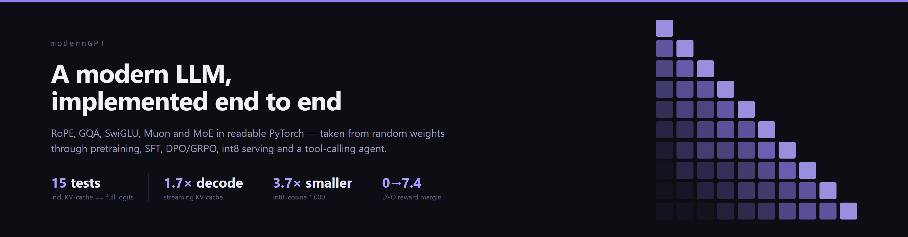
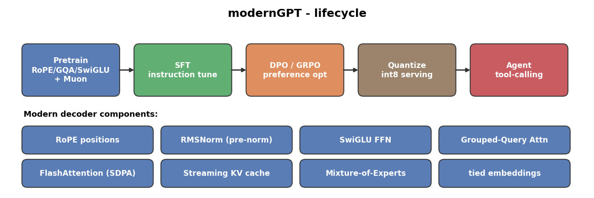
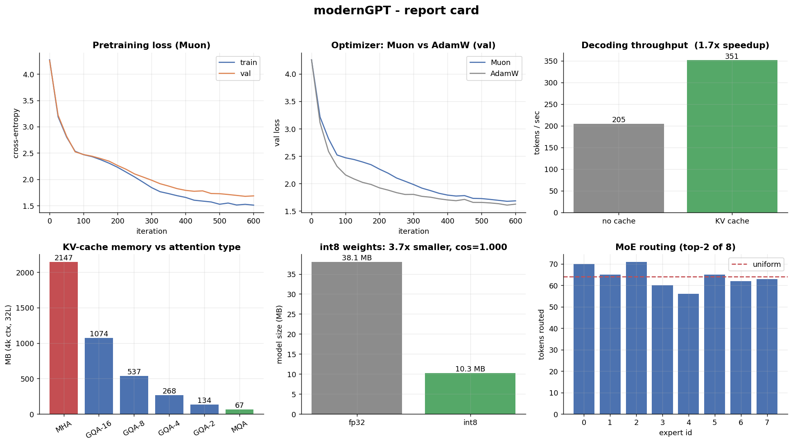
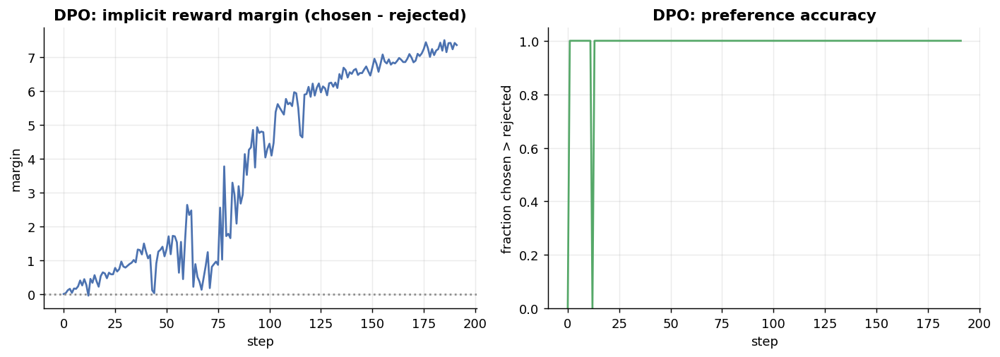

# modernGPT

A compact, **from-scratch** decoder-only language model that rebuilds Karpathy's
[minGPT](https://github.com/karpathy/minGPT) with the architecture and training
techniques that define **2023-2025 open LLMs** (Llama, Mistral, Qwen, DeepSeek),
and then walks that model through the **entire modern LLM lifecycle**:
pretraining, supervised fine-tuning, preference optimization (DPO/GRPO), int8
serving, and a tool-calling agent.

[](https://github.com/joaocordova/modernGPT/actions/workflows/ci.yml)
[](https://www.python.org/)
[](https://pytorch.org/)
[](LICENSE)
[](https://github.com/astral-sh/ruff)

minGPT is a faithful re-implementation of *GPT-2 (2019)*. modernGPT is the answer
to a harder question: **what actually changed in the six years since, can you
implement each piece yourself, and can you take a model the whole way from random
weights to a tool-using agent?**



> Everything below is backed by a runnable command and a passing test. The models
> here are tiny and trained briefly on CPU, by design: the point is a correct,
> complete, well-engineered *pipeline*, not a leaderboard score.

## What is modern about it

The original minGPT block is GPT-2. modernGPT swaps in the components used by
current open models, each implemented in readable code:

| Component           | minGPT / GPT-2 (2019)       | modernGPT (2025)                                   |
|---------------------|-----------------------------|----------------------------------------------------|
| Position encoding   | Learned absolute embeddings | **RoPE** (rotary), extrapolation-friendly          |
| Normalization       | LayerNorm (with bias)       | **RMSNorm**, pre-norm, fp32 internals              |
| Feed-forward        | GELU MLP                    | **SwiGLU** gated MLP                                |
| Attention           | Full multi-head             | **Grouped-Query Attention (GQA)**                  |
| Attention kernel    | Manual softmax(QK^T)        | **FlashAttention** via `scaled_dot_product_attention` |
| Decoding            | Recompute full context      | **Streaming KV cache** (O(1) work per new token)   |
| Optimizer           | AdamW                       | **Muon** (Newton-Schulz orthogonalized) + AdamW    |
| Capacity (optional) | Dense only                  | **Mixture-of-Experts** with load-balancing loss    |
| Output head         | Separate                    | **Tied** embeddings                                |

## Report card

Real measurements from this repo. Regenerate with `python scripts/benchmark.py &&
python scripts/make_figures.py`.



| Result                              | Value                  | Notes                                            |
|-------------------------------------|------------------------|--------------------------------------------------|
| Pretraining val loss (Muon, tiny)   | `1.68`                 | 600 iters, ~0.8M params, char-level, CPU         |
| KV-cache decode speedup             | `1.7x` (CPU, short ctx)| vs recomputing context every step; grows with ctx & on GPU |
| int8 weight quantization            | `3.7x` smaller         | output cosine `1.000` vs fp32                     |
| GQA KV-cache memory (32 -> 4 heads) | `8x` smaller           | the lever that makes long context affordable     |
| DPO reward margin (chosen-rejected) | `0.0` -> `7.4`         | preference optimization moves the right quantity |

## The lifecycle

Most minGPT forks stop at pretraining. The interesting parts of modern LLMs happen
*after*. This repo implements the whole chain, each stage with its own module and
test.

**1. Pretraining.** Modern decoder (`modern_gpt/model.py`) trained with Muon +
AdamW, AMP, gradient accumulation, and a cosine schedule (`modern_gpt/train.py`).

**2. Supervised fine-tuning** (`modern_gpt/finetune.py`). Instruction tuning with
the loss masked on prompt tokens, so the model learns to *produce* responses, not
memorize prompts.

**3. Preference optimization** - the centerpiece.
- **DPO** (`modern_gpt/dpo.py`), Rafailov et al. 2023: a single closed-form
  classification loss over preference pairs against a frozen reference model. The
  tests assert the exact identity that when policy == reference the loss is
  `log 2` - the cleanest possible correctness check.
- **GRPO** (`modern_gpt/grpo.py`), DeepSeekMath 2024: the critic-free, group-
  relative-advantage RL objective behind DeepSeek's reasoning models.



*DPO on a synthetic preference task: the implicit reward margin between chosen and
rejected responses climbs from 0 while preference accuracy saturates at 100%.*

**4. Efficient serving.** Weight-only **int8 quantization**
(`modern_gpt/quantize.py`) and a dependency-free HTTP inference server
(`modern_gpt/serve.py`) with the KV cache.

**5. Agents** (`modern_gpt/agent.py`). A ReAct-style Thought -> Action ->
Observation loop with tool dispatch, verified end-to-end on a calculator tool.

## Why this project is interesting

- **It is correct where it counts.** The headline test proves the streaming KV
  cache yields the *same logits* (atol 1e-4) as a full forward pass - the single
  most common place a from-scratch transformer is subtly wrong (off-by-one RoPE
  positions, causal-mask leakage). Most reimplementations never check this.
- **It implements post-training from scratch.** DPO and GRPO are written out and
  tested against their defining mathematical identities, not imported from a
  library.
- **It is current.** Muon (the nanoGPT speedrun optimizer), GQA, RoPE, SwiGLU,
  MoE, GRPO - the techniques are from 2023-2025, not 2019.
- **It is honest about scale.** Tiny models, short CPU runs, synthetic data - and
  the README says so. The deliverable is the engineering, measured.
- **It is engineered, not just scripted.** Typed config, presets, a real test
  suite, CI, ruff, and reproducible figure generation.

## Quickstart

Verified on Python 3.14 / PyTorch 2.11 (CPU). Use `--preset small` on a GPU for
real runs.

```bash
pip install -r requirements.txt

# 1) data (downloads tiny-shakespeare; offline fallback bundled)
python scripts/prepare_shakespeare.py

# 2) pretrain
python -m modern_gpt.train --preset tiny --data_dir data/shakespeare_char \
    --max_iters 2000 --warmup_iters 100 --batch_size 24 --device auto

# 3) sample (uses the KV cache)
python -m modern_gpt.sample --ckpt out/ckpt.pt --data_dir data/shakespeare_char \
    --prompt "ROMEO:" --max_new_tokens 300

# 4) reproduce the benchmarks and figures
python scripts/benchmark.py
python scripts/make_figures.py

# tests (no pytest required)
python tests/test_model.py
python tests/test_posttrain.py
```

### Serve a checkpoint (int8, online inference)

```bash
python -m modern_gpt.serve --ckpt out/ckpt.pt --data_dir data/shakespeare_char --quantize
curl -s localhost:8000/generate -d '{"prompt":"ROMEO:","max_new_tokens":80}'
```

## Repository layout

```
modern_gpt/
  config.py      typed GPTConfig dataclass + presets (tiny / small / moe)
  model.py       RoPE, RMSNorm, SwiGLU, GQA attention, KV cache, MoE, ModernGPT
  optim.py       Muon optimizer + Newton-Schulz orthogonalization + grouping
  train.py       AMP + grad-accum + cosine schedule + checkpointing
  sample.py      KV-cache generation
  rl_utils.py    sequence log-probabilities (shared by SFT/DPO/GRPO)
  finetune.py    supervised fine-tuning with prompt masking
  dpo.py         Direct Preference Optimization
  grpo.py        Group Relative Policy Optimization
  quantize.py    int8 weight-only post-training quantization
  serve.py       dependency-free HTTP inference server
  agent.py       ReAct tool-calling loop
  tokenizer.py   tiktoken BPE + char-level tokenizer
  data.py        memory-mapped uint16 token dataset
scripts/         prepare_shakespeare.py, benchmark.py, make_figures.py
tests/           test_model.py (7), test_posttrain.py (8)
assets/          generated figures
```

## Architecture

```
                       tokens
                         |
                  Embedding (tied)
                         |
   +----------------- N x Block ------------------+
   |   RMSNorm -> GQA( RoPE, SDPA, KV-cache ) -> + |
   |   RMSNorm -> SwiGLU  (or MoE top-k)       -> + |
   +-----------------------------------------------+
                         |
                     RMSNorm
                         |
                  LM head (tied)
```

## Tech stack

Python, PyTorch (`scaled_dot_product_attention`, `autocast`, custom
`torch.optim.Optimizer`), NumPy (memory-mapped data), tiktoken (BPE), matplotlib
(figures), ruff (lint), GitHub Actions (CI).

## Notes

The models are intentionally tiny and trained briefly on CPU; numbers are for a
correct, reproducible *demo*, not a benchmark leaderboard. Architecture lineage
and the char-level training setup follow Andrej Karpathy's minGPT / nanoGPT; the
modernization (RoPE, RMSNorm, SwiGLU, GQA, KV cache, Muon, MoE) and the full
post-training + serving + agent lifecycle are this project's contribution.
Licensed under MIT.
